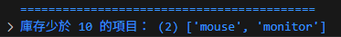
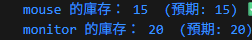
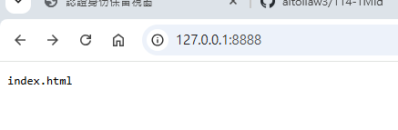
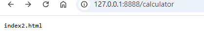
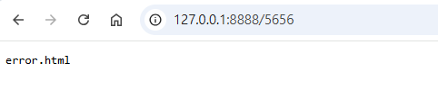
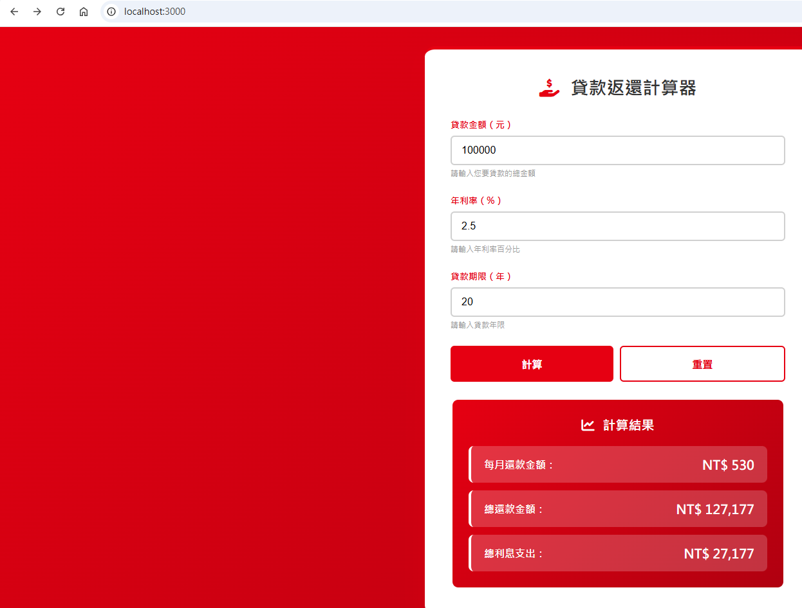
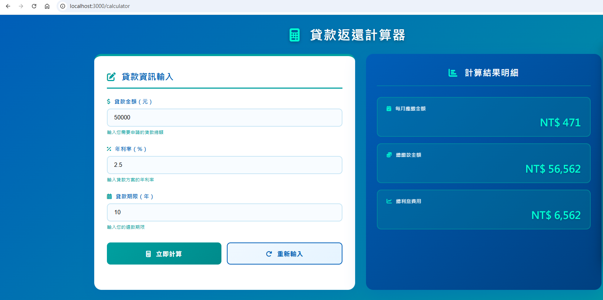

# 第2次隨堂題目-隨堂-QZ2
>
>學號：111111156   (學號和姓名都要寫)
><br />
>姓名：林家揚
>

本份文件包含以下主題：(至少需下面兩項，若是有多者可以自行新增)
- [x] 說明內容

## 說明程式與內容

開始寫說明，該說明需說明想法，
並於之後再對上述想法的每一部分將程式進一步進行展現，
若需引用程式區則使用下面方法，
若為.cs檔內程式除了於敘述中需註明檔案名稱外，
還需使用語法` ```語言種類 程式碼 ``` `，其中語言種類若是要用python則使用py，java則使用java，C/C++則使用cpp，
下段程式碼為語言種類選擇csharp使用後結果：


1. a.

Ans: 
const 關鍵字： 在 JavaScript 中，const 關鍵字用於宣告一個常量。
products 變數： 這是一個使用者自訂的名稱，用來指代一個常量。
products 被賦值，就是不能在改變數字打什麼就是固定那些文字所以不會有{ name: "keyboard", stock: 10 }等等這是錯誤的，下面範例才是正確的宣告啥就是啥。
例如：const products = [{ name: "keyboard", stock: 25 }, 
                      { name: "mouse", stock: 5 }, 
                      { name: "monitor", stock: 8 }, 
                      { name: "use cable", stock: 40 } ];


1. b.
Ans:
```js
function getLowStock(products) {
    // 創建一個函式getLowStock，參數為products
    let lowStockItems = [];
    // 創造1個空陣列lowStockItems，專門存放庫存少於10的商品名稱
    for (let i = 0; i < products.length; i++) {
        // 用for迴圈跑products陣列，每次迴圈i加1
        if (products[i].stock < 10) {
            lowStockItems.push(products[i].name);
        };
        // 如果products陣列中第i個物件的stock屬性小於10，則把該物件的name屬性加入lowStockItems陣列
    };
    console.log("庫存少於 10 的項目：" ,lowStockItems); //最後印出庫存少於10的商品名稱以及結果陣列並回傳陣列。
    return lowStockItems;
};
```


最後印出庫存少於10的商品名稱以及結果陣列並回傳陣列。


<!-- 請撰寫時，最後一句話再寫一次 -->


1. c.

Ans:
建立一個新的空陣列


```js
function updateStock(products, updates) {
  
  // 1. 建立一個新的空陣列
  const updatedProducts = [];

  // 2. 使用 for...of 迴圈遍歷 products 陣列
  for (const product of products) {
    
    // 3. 取得當前商品的名稱
    const productName = product.name;

    // 4. 從 updates 物件中查找新庫存
    const newStock = updates[productName];

    
    // 5. 判斷是否需要更新庫存
    if (newStock !== undefined) {
      
      // 5a. 如果需要更新：手動創建一個包含新庫存的「新物件」
      const newProduct = {
        name: productName,   
        stock: newStock      
      };
      
      // 將更新後的物件加入結果陣列
      updatedProducts.push(newProduct);
      
    } else {
      
      // 5b. 如果不需要更新：複製原始物件的屬性到一個新物件中
      const newProduct = {
        name: product.name,
        stock: product.stock 
      };
      
      // 將未更新的物件副本加入結果陣列
      updatedProducts.push(newProduct);
    }
  }
  
  // 6. 遍歷更新後的陣列，並印出結果
  // ********** 核心修改：將箭頭函式替換成傳統的匿名函式 **********
  // 傳統函式寫法：function (參數) { 程式碼區塊 }
  updatedProducts.forEach(function (product) {
      // 在此函式內部，product 依然代表陣列中的每個元素
      
      // 使用「+」運算子來連接字串和變數，避免使用模板字串 (${})
      console.log(product.name + " 的庫存： " + product.stock);
  });

  // 7. 函式回傳更新後的陣列
  return updatedProducts;
}
  ```
  
  

<!--  請撰寫時，第一句話再寫一次  -->

2. a.
由上述程式碼可知該程式是建立HTTP協議的服務

Ans:
```js
switch (url) {
    case '/':
      answer = 'index.html';
      break;
    case '/calculator':
      answer = 'index2.html';
      break;
    default:
      answer = 'error.html';
  }
```



由上述程式碼可知該程式是建立HTTP協議的服務，這個服務會有請求request與response回應，請求再回網址列即為請求中的url屬性因此當我的網址列有呼叫
不同資源時就會根據你的程式碼switch case決定應該要顯示什麼內容，因為網址列只有IP以及port所以預設會去抓取該網站的根目錄資源，因此會執行case'/'
的選擇，當我的資源為'/calculator'則顯示index2.html的內容，當選擇不是上述二種情形時會直接輸出error.html的部分。

2. b.
由上述程式碼可知使用者輸入的網址(req.url)就會執行不同區塊程式碼的顯示部分

Ans:
```js
switch (req.url) {
    case '/':
      //首頁路由
      filePath = '/index.ejs';
      break;
    case '/calculator':
      //計算器頁面路由
      filePath = '/index2.ejs';
      break;
    case '/style.css':
      //靜態CSS檔案
      fileOtherFile = '/style.css';
      break;
    case '/script.js':
      //靜態資源路由：JavaScript腳本
      fileOtherFile = '/script.js';
      break;
    case '/style2.css':
      //靜態資源路由：計算器頁面CSS
      fileOtherFile = '/style2.css';
      break;
  }
  ```
  


由上述程式碼可知使用者輸入的網址(req.url)就會執行不同區塊程式碼的顯示部分，filepPath是一個變數用來讀取EJS模板檔案，break就是這個條件
執行完直接叫出代表已讀取那部分的程式碼區塊不繼續執行，如果使用者請求/style.css這個檔案，瀏覽器會自動請求樣式表server會回傳這個CSS檔。
<!--  請撰寫時，第一句話再寫一次  -->

2. c.

Ans:
由上述程式碼可知使用者輸入的網址(req.url)，


```js
 case '/style3.css':
      // 靜態 CSS 檔案路由  
      fileOtherFile = '/style3.css';
      break;   
    default:  
      // 其他路由 → 404 頁面  
      filePath = '/index3.ejs'; 
      break;
  }
```

由上述程式碼可知使用者輸入的網址(req.url)，如果以上輸入的網址列不是上述的情況就回直接跳到預設程式碼區塊，則顯示404頁面讀取'/style3.css'的樣式表。

則顯示404頁面讀取'/style3.css'的樣式表。
<!--  請撰寫時，第一句話和最後一句再寫一次  -->

2. d.

Ans:0


